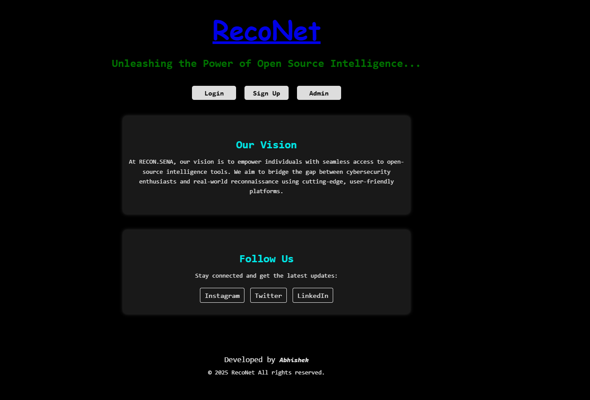
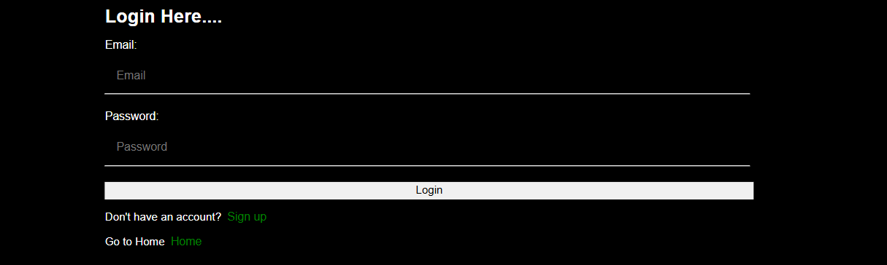
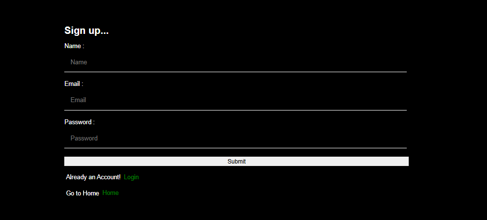
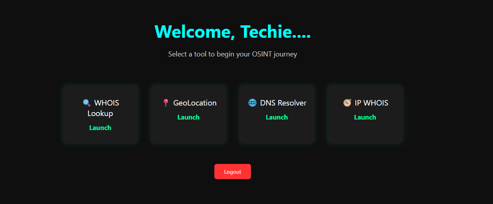
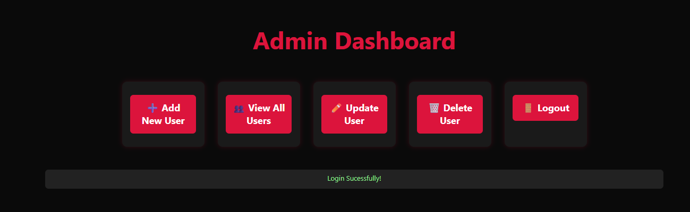
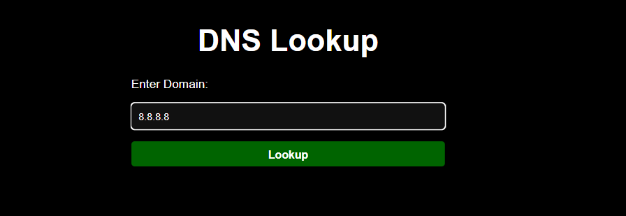
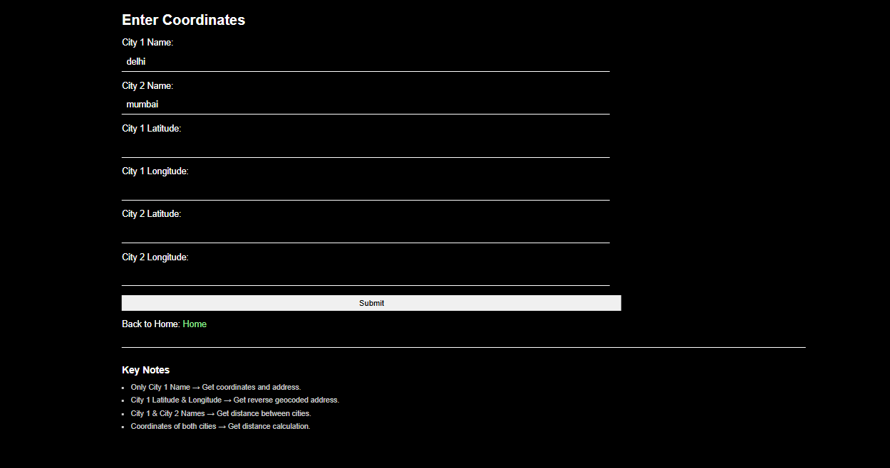

# 🕵️ RecoNet - Flask OSINT Reconnaissance Tool

RecoNet is a modular, Flask-based OSINT tool designed for reconnaissance and information gathering. It leverages Flask Blueprints to keep services organized and scalable, offering essential tools like DNS resolution, Geo IP lookup, IPWhois, and domain Whois queries.

---

## 🚀 Features

- ✅ Flask Modular Architecture using Blueprints
- 🔒 Admin/User Login, Signup, and Session Handling
- 📋 Admin Dashboard with CRUD operations
- 🌐 OSINT Services:
  - DNS Resolver
  - IPWhois Lookup
  - WHOIS Lookup
  - Geolocation (GeoPy)
- 📥 Export OSINT results as PDF
- 🧠 CSS & Jinja Templates
- 🗃️ SQLAlchemy for local development

---

## 🖼️ Screenshots

> All screenshots are stored in the `/screenshots` directory.

| Home | Login | Signup |
|------|-------|--------|
|  |  |  |

| User Dashboard | Admin Dashboard |
|----------------|------------------|
|  |  |

| DNS Resolver | IPWhois | Whois | GeoPy |
|--------------|----------|--------|--------|
|  |  |  |  |

---

## 👤 Demo Credentials

You can use the following credentials to explore the app:

- **User Login:**  
  `Email`: `demo@gmail.com`  
  `Password`: `demo1234`

- **Admin Login:**  
  `email`: `admin@gmail.com`  
  `Password`: `#admin1234`

---

## 🧩 Installation Guide

### 1. Clone the Repository

```bash
git clone https://github.com/abh0x1/RecoNet.git
cd RecoNet
````

### 2. Setup Virtual Environment

```bash
python -m venv env
# Activate environment
# Windows:
env\Scripts\activate
# Linux/macOS:
source env/bin/activate
```

### 3. Install Dependencies

```bash
pip install -r requirements.txt
```

### 4. Setup Database

```bash
python create_db.py
python create_admin.py   # Creates admin account
```

### 5. Run the App

```bash
python run.py
```

Visit the app at: [http://127.0.0.1:8080](http://127.0.0.1:8080)

---

## 🛠️ Basic Usage

1. **Home Page** - Navigate to the homepage to start.
2. **Signup / Login** - Create a new user or login as a user or admin.
3. **User Dashboard** - Access tools like DNS Resolver, IPWhois, GeoPy, and Whois.
4. **Admin Panel** - Add, delete, and manage users.
5. **Generate PDF** - After using a tool, export the result in PDF format.

Each tool has a form-based input to run reconnaissance queries and view results.

---

## 🧹 Cleanup (Optional)

If you want to remove cache files before committing:

**Windows PowerShell:**

```powershell
Get-ChildItem -Recurse -Include "__pycache__", "*.pyc" | Remove-Item -Recurse -Force
```

**Linux/macOS:**

```bash
find . -type d -name "__pycache__" -exec rm -r {} +
find . -name "*.pyc" -delete
```

---

## 📁 Folder Structure

```
RecoNet/
│   run.py
│   create_db.py
│   create_admin.py
│   config.py
│   requirements.txt
│
├───app/
│   ├───admin/
│   ├───auth/
│   ├───main/
│   ├───user/
│   ├───services/
│   │   ├───dnsres/
│   │   ├───geopy/
│   │   ├───ipwhois/
│   │   └───whois/
│   └───templates/
│
├───instance/
│   └───site.db
│
└───screenshots/
    ├───home.png
    ├───login.png
    ├───signup.png
    ├───user.png
    ├───admin.png
    ├───dns.png
    ├───ipwhois.png
    ├───whois.png
    └───geopy.png
```

---

## 📝 License

This project is licensed under the MIT License.

---

## 🤝 Contributions

Pull requests, issues, and ideas are always welcome! Let’s make open-source recon tools more powerful.

